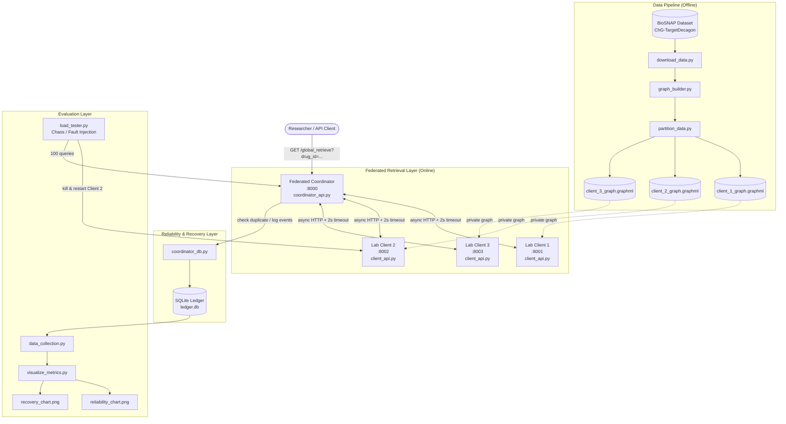
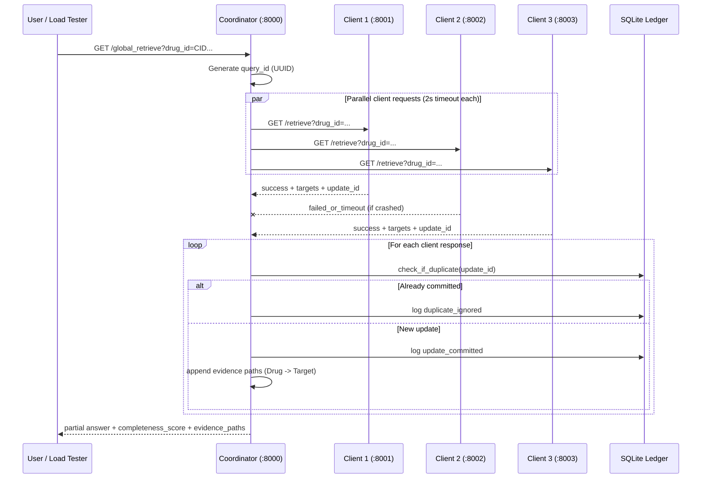

# Failure-Aware Federated Graph-RAG for Drug-Target Interaction Retrieval with Exactly-Once Checkpoint Recovery

[](https://www.python.org/)
[](https://fastapi.tiangolo.com/)
[](https://networkx.org/)
[](https://www.sqlite.org/)

A federated biomedical graph retrieval prototype that continues answering drug-target queries when simulated lab clients crash, reports retrieval completeness, and enforces exactly-once recovery using a lightweight append-only SQLite ledger—without blockchain consensus.

---

## Table of Contents

1. [Core Novelty](#core-novelty)
2. [System Architecture](#system-architecture)
3. [Request Flow](#request-flow)
4. [Technology Stack](#technology-stack)
5. [Prerequisites & Setup](#prerequisites--setup)
6. [How to Run the System](#how-to-run-the-system)
7. [Evaluation & Metrics](#evaluation--metrics)
8. [Project Structure](#project-structure)
9. [API Reference](#api-reference)
10. [Dataset](#dataset)
11. [Troubleshooting](#troubleshooting)

---

## Core Novelty

Traditional federated Graph-RAG systems for computational biology often assume that all participating client nodes are available during retrieval. In practice, local hospital or research lab servers may crash, become slow, or disconnect while processing graph-based drug-target queries.

This project addresses two reliability problems:

| Problem | Our Approach |
|---------|----------------|
| **Client failure during retrieval** | The coordinator uses timeout-based collection, returns partial answers, and reports `available_clients`, `missing_clients`, and a `completeness_score`. |
| **Duplicate updates after recovery** | An append-only SQLite checkpoint ledger assigns unique `update_id` values and rejects replayed client payloads with `duplicate_ignored` events. |

**Key design choice:** We use a lightweight **SQLite append-only ledger** instead of heavy blockchain or distributed consensus, keeping the prototype feasible for academic demonstration while preserving auditability.

---

## System Architecture

The system simulates three independent research labs. Each lab stores a **private local drug-target graph partition**. Raw biomedical graph data never leaves the client. The coordinator only receives retrieval summaries and evidence paths.



### Component Overview

| Component | Port | Responsibility |
|-----------|------|----------------|
| **Lab Client 1** | `8001` | Local Graph-RAG-lite retrieval on partition 1 |
| **Lab Client 2** | `8002` | Local Graph-RAG-lite retrieval on partition 2 (fault-injection target) |
| **Lab Client 3** | `8003` | Local Graph-RAG-lite retrieval on partition 3 |
| **Federated Coordinator** | `8000` | Parallel broadcast, timeout handling, evidence aggregation, completeness scoring |
| **Append-Only Ledger** | N/A | Exactly-once update tracking and audit trail |
| **Load Tester** | N/A | Simulates hardware failure by killing/restarting Client 2 during queries |

---

## Request Flow



### Example Coordinator Response

```json
{
  "query": "CID000000271",
  "query_id": "a1bbace2-836a-4b84-a723-3211e7b5f90a",
  "completeness_score": "2/3",
  "available_clients": ["Client_1", "Client_3"],
  "missing_clients": ["Client_2"],
  "evidence_paths_count": 120,
  "evidence_paths": [
    {
      "client_id": "Client_1",
      "path": "CID000000271 -> 2990"
    }
  ],
  "raw_responses": []
}
```

---

## Technology Stack

| Layer | Tools |
|-------|-------|
| Language | Python 3.10+ |
| Web APIs | FastAPI, Uvicorn |
| Graph processing | NetworkX, pandas |
| Async HTTP | httpx, aiohttp |
| Fault injection | psutil, subprocess |
| Persistence | SQLite (append-only ledger) |
| Evaluation | matplotlib, numpy |

---

## Prerequisites & Setup

All commands below assume you are in the **project root directory**.

### 1. Create and activate a virtual environment

```bash
python -m venv venv
```

**Windows (PowerShell):**

```bash
.\venv\Scripts\Activate.ps1
```

**macOS / Linux:**

```bash
source venv/bin/activate
```

### 2. Install dependencies

```bash
pip install -r requirements.txt
```

Or install explicitly:

```bash
pip install fastapi uvicorn networkx pandas requests aiohttp psutil matplotlib numpy httpx
```

### 3. Download and partition the dataset

```bash
python download_data.py
python graph_builder.py
python partition_data.py
```

**Generated files:**

| File | Description |
|------|-------------|
| `data/ChG-TargetDecagon_targets.csv.gz` | Raw BioSNAP drug-target edge list |
| `data/client_1_graph.graphml` | Lab 1 private graph partition |
| `data/client_2_graph.graphml` | Lab 2 private graph partition |
| `data/client_3_graph.graphml` | Lab 3 private graph partition |

### 4. Initialize the ledger database

```bash
python ledger/ledger_manager.py
```

Expected output:

```text
Success: SQLite append-only ledger initialized at /ledger/ledger.db
```

---

## How to Run the System

Open **four separate terminals** from the project root with the virtual environment activated.

### Step 1 — Start the 3 lab clients

**Terminal 1 — Client 1:**

```bash
python client_api.py --port 8001 --file data/client_1_graph.graphml --name Client_1
```

**Terminal 2 — Client 2:**

```bash
python client_api.py --port 8002 --file data/client_2_graph.graphml --name Client_2
```

**Terminal 3 — Client 3:**

```bash
python client_api.py --port 8003 --file data/client_3_graph.graphml --name Client_3
```

### Step 2 — Start the federated coordinator

**Terminal 4:**

```bash
python coordinator/coordinator_api.py
```

### Step 3 — Test a federated query

Open in a browser or API client:

```text
http://localhost:8000/global_retrieve?drug_id=CID000000271
```

**Healthy system:** `completeness_score` should be `"3/3"`.

**With Client 2 stopped:** `completeness_score` should be `"2/3"` and `Client_2` appears in `missing_clients`.

### Step 4 — Run chaos / fault-injection load test

Default run (100 queries, 30% fault rate):

```bash
python load_tester.py
```

Shorter demo run:

```bash
python load_tester.py --queries 20
```

### Step 5 — Collect metrics and generate charts

```bash
python data_collection.py
python visualize_metrics.py
```

**Outputs:**

- Terminal summary of ledger metrics
- `reliability_chart.png` — full vs degraded answers under fault injection
- `recovery_chart.png` — committed updates vs ignored duplicates

### Optional — Exactly-once recovery simulation

```bash
python simulate_recovery.py
```

Verifies that a stale Client 1 payload replay is rejected by the ledger.

---

## Evaluation & Metrics

This prototype is evaluated on **retrieval reliability** and **exactly-once recovery**.

### Federated retrieval reliability

| Metric | Description |
|--------|-------------|
| Query success rate | Percentage of coordinator queries returning HTTP 200 under client crashes |
| Completeness score | `available_clients / total_clients` (e.g., `2/3`) |
| Degraded-mode queries | Queries answered with fewer than all clients |
| Evidence path count | Number of `Drug -> Target` paths aggregated |

### Exactly-once recovery

| Metric | Description |
|--------|-------------|
| Committed updates | Rows with `status = update_committed` |
| Ignored duplicates | Rows with `status = duplicate_ignored` |
| Ledger overhead | Growth of append-only audit events |

Example metrics from a 20-query fault-injection run:

```text
Full Answers (3/3): 15
Degraded Answers (<3/3): 5
```

Example ledger metrics:

```text
Total Ledger Entries: 504
Committed Updates: 428
Ignored Duplicates: 2
```

---

## Project Structure

```text
FL_DRUG_DISCOVERY/
├── client_api.py                 # Reusable FastAPI lab client
├── coordinator/
│   ├── coordinator_api.py        # Federated coordinator (async + timeout)
│   └── coordinator_db.py         # Ledger duplicate-check helpers
├── ledger/
│   ├── ledger_manager.py         # SQLite schema initialization
│   └── ledger.db                 # Append-only checkpoint ledger (local, gitignored)
├── data/
│   ├── ChG-TargetDecagon_targets.csv.gz
│   ├── client_1_graph.graphml
│   ├── client_2_graph.graphml
│   └── client_3_graph.graphml
├── download_data.py              # BioSNAP dataset downloader
├── graph_builder.py              # Global NetworkX graph loader
├── partition_data.py             # Federated graph partitioning
├── load_tester.py                # Chaos engineering / load testing
├── data_collection.py            # Ledger metrics extraction
├── visualize_metrics.py          # Presentation charts (matplotlib)
├── simulate_recovery.py          # Stale payload replay test
├── requirements.txt
└── README.md
```

---

## API Reference

### Client endpoint

```http
GET /retrieve?drug_id={drug_id}
```

| Field | Description |
|-------|-------------|
| `client_id` | Lab identifier |
| `drug_id` | Queried drug |
| `targets` | Local neighbor target IDs |
| `status` | `success` or `not_found` |
| `update_id` | Unique idempotency key for ledger |

### Coordinator endpoint

```http
GET /global_retrieve?drug_id={drug_id}
```

| Field | Description |
|-------|-------------|
| `query_id` | Federated query UUID |
| `completeness_score` | e.g., `3/3`, `2/3` |
| `available_clients` | Clients that responded |
| `missing_clients` | Clients that timed out or failed |
| `evidence_paths` | List of `{client_id, path}` provenance records |
| `raw_responses` | Per-client JSON payloads |

---

## Dataset

**BioSNAP / Stanford Drug-Target Interaction Network (ChG-Target Decagon)**

- Dataset page: https://snap.stanford.edu/biodata/datasets/10015/10015-ChG-TargetDecagon.html
- Direct file: https://snap.stanford.edu/biodata/datasets/10015/files/ChG-TargetDecagon_targets.csv.gz

The global graph contains approximately **3,932 nodes** and **18,690 edges**, partitioned across three simulated lab clients.

---

## Troubleshooting

| Issue | Solution |
|-------|----------|
| `ModuleNotFoundError: No module named 'ledger'` when starting coordinator | Run from project root: `python coordinator/coordinator_api.py` |
| Port `8002` already in use | A background Client 2 may still be running from `load_tester.py`. Use `netstat -ano \| findstr :8002` (Windows) and stop the process. |
| All queries return `3/3` during chaos testing | Increase downtime: `python load_tester.py --downtime 2.5` |
| `matplotlib` not found | Run `pip install -r requirements.txt` |
| Drug returns `not_found` | Use a valid CID from the graph, e.g. `CID000000271` |

---

## Academic Context

This repository implements a **failure-aware federated biomedical graph retrieval prototype** that:

1. Continues operating under client crashes.
2. Reports retrieval completeness and missing evidence sources.
3. Uses an append-only checkpoint ledger for exactly-once recovery without blockchain consensus.

Suitable for internship demonstration, conference poster, and final project submission.

---

## License

Academic research prototype for internship submission.
