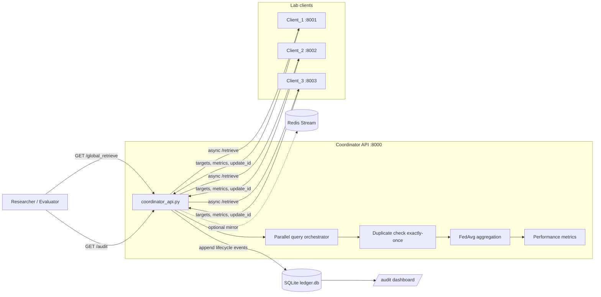

# Failure-Aware Federated Graph Retrieval for Drug-Target Interaction with Exactly-Once Ledger Recovery

[](https://www.python.org/)
[](https://fastapi.tiangolo.com/)
[](https://www.sqlite.org/)
[](https://redis.io/)

Federated biomedical retrieval prototype that:

- keeps graph partitions local on each lab client,
- continues answering under partial client failure (`completeness_score`, `missing_clients`),
- trains a local link-predictor (classification or DeepDTA-style regression) per client,
- federates model weights with FedAvg on the coordinator,
- enforces exactly-once update commitment via a SQLite checkpoint ledger,
- exposes runtime metrics for confidence, latency, failure state, and ledger storage overhead.

---

## Table of Contents

1. [Core Novelty](#core-novelty)
2. [Architecture](#architecture)
3. [Runtime Flow](#runtime-flow)
4. [Technology Stack](#technology-stack)
5. [Setup](#setup)
6. [Runbook (Live Demo)](#runbook-live-demo)
7. [Evaluation and Experiments](#evaluation-and-experiments)
8. [API Reference](#api-reference)
9. [Project Structure](#project-structure)
10. [Troubleshooting](#troubleshooting)

---

## Core Novelty

| Reliability problem | Implementation |
|---|---|
| Client timeout or crash during query | Async parallel retrieval + degraded but valid partial answer |
| Stale update replay after reboot | Exactly-once duplicate detection on committed `update_id`; replays logged as `duplicate_ignored` and excluded from evidence |

**Design choices**

- **SQLite append-only ledger** (not blockchain) for exactly-once semantics and full audit trail.
- **Rich event taxonomy** (`query_started` → `update_committed`, etc.).
- **Optional Redis Stream mirror** (`federated:ledger:stream`) — SQLite remains source of truth; Redis is not a cache and does not speed up HTTP APIs.

---

## Architecture



Each client loads a **NetworkX GraphML partition**, trains a **PyTorch LinkPredictor** on sampled edges, scores neighbors for the queried drug, and returns evidence plus optional model weights for FedAvg.

---

## Runtime Flow

1. `GET /global_retrieve?drug_id=...` hits the coordinator.
2. Coordinator assigns `query_id`, increments in-memory `round_id`, logs `query_started`.
3. Parallel `/retrieve` calls to all three clients (90s timeout each in full ML mode).
4. Per client response:
   - log `client_responded`,
   - `check_if_duplicate(update_id)` against committed rows,
   - if duplicate → `duplicate_ignored`, skip evidence and commit,
   - else → `update_uploaded` (when weights present) and `update_committed`.
5. Merge evidence paths, FedAvg weights, compute confidence and gas metrics.
6. Return JSON including `performance_metrics` (`total_latency_ms`, `system_state`, `ledger_size_kb`).

### Ledger event taxonomy

`query_started` · `client_responded` · `update_uploaded` · `update_committed` · `duplicate_ignored` · `client_timeout` · `client_recovered`

---

## Technology Stack

| Layer | Tools |
|---|---|
| API | FastAPI, Uvicorn |
| Graph | NetworkX (GraphML partitions) |
| Local ML | PyTorch (embeddings + MLP link predictor) |
| Metrics | scikit-learn (classification); MSE / R² (regression) |
| Coordinator I/O | httpx (async) |
| Ledger | SQLite (`coordinator/coordinator_db.py`) |
| Optional mirror | redis-py → Redis Stream |
| Evaluation | pandas, matplotlib, aiohttp (load tester) |

---

## Setup

All commands assume project root with an active virtual environment.

### 1) Virtual environment (Windows PowerShell)

```powershell
python -m venv venv
.\venv\Scripts\Activate.ps1
pip install -r requirements.txt
```

### 2) Data pipeline

```powershell
python download_data.py
python graph_builder.py
python partition_data.py
```

Expected outputs:

- `data/client_1_graph.graphml`
- `data/client_2_graph.graphml`
- `data/client_3_graph.graphml`

### 3) Initialize ledger schema

```powershell
python ledger/ledger_manager.py
```

### 4) Optional Redis (Docker)

Start Redis **before** the coordinator if you want stream mirroring:

```powershell
docker run -d --name redis-nitt -p 6379:6379 redis:7-alpine
docker exec redis-nitt redis-cli PING
```

The coordinator pings `localhost:6379` once at import time. There is no console log on success; verify with:

```powershell
docker exec redis-nitt redis-cli XLEN federated:ledger:stream
```

Restart the coordinator after Redis is up if it was started without Redis.

---

## Runbook (Live Demo)

Open **four terminals** (venv active).

**Terminal 1 — Coordinator**

```powershell
python coordinator/coordinator_api.py
```

**Terminal 2 — Client 1**

```powershell
python client_api.py --port 8001 --file data/client_1_graph.graphml --name Client_1
```

**Terminal 3 — Client 2**

```powershell
python client_api.py --port 8002 --file data/client_2_graph.graphml --name Client_2
```

**Terminal 4 — Client 3**

```powershell
python client_api.py --port 8003 --file data/client_3_graph.graphml --name Client_3
```

### Quick API checks

**Single client (classification, browser-safe JSON — no full weight tensors):**

```powershell
curl "http://localhost:8001/retrieve?drug_id=CID000000271"
```

**Regression mode (Task 20 — DeepDTA-style affinity):**

```powershell
curl "http://localhost:8001/retrieve?drug_id=CID000000271&task_type=regression"
```

**Federated retrieve (save large JSON to file):**

```powershell
curl "http://localhost:8000/global_retrieve?drug_id=CID000000271&mode=aware" -o response.json
```

**Audit dashboard (browser):**

```text
http://localhost:8000/audit
```

### Evaluation scripts (Terminal 5)

```powershell
python load_tester.py
python data_collection.py
python visualize_metrics.py
python simulate_recovery.py
python evaluate_baselines.py
python experiment_duplicate_rate.py
```

`load_tester.py` defaults: 10 queries, full ML per query, random Client 2 kill/restart (~40% fault rate). Charts: `reliability_chart.png`, `recovery_chart.png`.

---

## Evaluation and Experiments

### Failure vs healthy latency (Task 14)

- All clients up → `completeness_score = 3/3`, `system_state = no_failure`.
- One client down → `<3/3`, `system_state = failure`.
- Compare `performance_metrics.total_latency_ms`.

### Duplicate replay (Task 16)

```powershell
python experiment_duplicate_rate.py
```

Reports baseline duplicate rate vs exactly-once interception and `duplicate_ignored` counts.

### Recovery simulation

```powershell
python simulate_recovery.py
```

Stops real Client 1, serves a stale payload with an already-committed `update_id`, and verifies dummy targets are excluded from `evidence_paths`.

### Storage overhead (Task 18)

- `/audit` — ledger size badge
- `/global_retrieve` → `performance_metrics.ledger_size_kb`

### Redis mirror validation

After a `global_retrieve` with Redis running before coordinator boot:

```powershell
docker exec redis-nitt redis-cli XREVRANGE federated:ledger:stream + - COUNT 5
```

Events are duplicated from SQLite into the stream; they are not stored as files under the project tree.

### Gas optimization metrics (simulated)

Toy cost model in the coordinator response:

- `simulated_unbatched_gas` = 100 × number of evidence targets
- `actual_batched_gas` = 40 × number of successful clients
- `gas_saved_percentage` = percent saved by batching per client vs per target

Positive values are typical when clients return many neighbors; small runs with few paths may still show lower savings.

---

## API Reference

### `GET /retrieve` (client)

| Parameter | Default | Description |
|---|---|---|
| `drug_id` | required | Drug node ID (e.g. `CID000000271`) |
| `task_type` | `classification` | `classification` or `regression` |
| `include_weights` | `false` | `true` sends full tensors (coordinator FedAvg); `false` sends `model_weights_summary` only |
| `fast` | `false` | Skip ML training; graph neighbors only (demo / load-test shortcut) |

Key response fields: `status`, `targets` (`path`, `ml_score`), `metrics`, `update_id`, `batch_hash`, `local_confidence`.

**Classification metrics:** `precision`, `recall`, `f1_score`, `top_50_precision`  
**Regression metrics:** `mse`, `r2`

### `GET /global_retrieve` (coordinator)

| Parameter | Default | Description |
|---|---|---|
| `drug_id` | required | Drug to query across all clients |
| `mode` | `aware` | `aware` returns partial answers; `unaware` errors if any client missing |
| `task_type` | `classification` | Passed to all clients |
| `fast` | `false` | Propagates fast graph-only mode to clients |

Key response fields:

- `query_id`, `round_id`, `completeness_score`, `retrieval_confidence_score`
- `available_clients`, `missing_clients`, `evidence_paths`
- `client_link_prediction_metrics`, `federated_link_prediction_metrics`
- `global_aggregated_model` (layer shapes only in API)
- `gas_optimization_metrics`, `performance_metrics`
- `raw_responses` (weights stripped)

### Other coordinator routes

| Route | Purpose |
|---|---|
| `GET /audit_data?limit=100` | Latest ledger rows as JSON |
| `GET /audit` | HTML audit dashboard |
| `GET /client_checkpoint/{client_name}` | Latest committed checkpoint metadata |

---

## Project Structure

```text
FL_DRUG_DISCOVERY/
├── client_api.py              # Client API + LinkPredictor training
├── coordinator/
│   ├── coordinator_api.py     # Federated orchestrator + FedAvg
│   └── coordinator_db.py      # SQLite ledger + optional Redis mirror
├── ledger/
│   ├── ledger_manager.py      # Schema init
│   └── ledger.db              # Append-only audit log (local)
├── data/                      # GraphML partitions (generated)
├── audit.html                 # Audit dashboard template
├── load_tester.py             # Fault-injection load test
├── simulate_recovery.py       # Stale replay demo
├── experiment_duplicate_rate.py
├── evaluate_baselines.py
├── data_collection.py
├── visualize_metrics.py
├── download_data.py
├── graph_builder.py
├── partition_data.py
├── requirements.txt
└── README.md
```

---

## Troubleshooting

| Issue | Resolution |
|---|---|
| Port already in use (`10048`) | `netstat -ano \| findstr :800X` then `taskkill /PID <pid> /F` |
| Browser hangs on client `/retrieve` | Use default (`include_weights=false`) or coordinator `/global_retrieve`; do not paste huge JSON in browser |
| `load_tester` kills Client 2 but manual Client 2 also running | Use either manual Client 2 **or** load tester auto-restart, not both |
| Redis stream empty | Start Redis before coordinator; restart coordinator after Redis is up |
| `round_id` always `1` in old ledger rows | Legacy rows before taxonomy migration; sort by `id DESC` for current rows |
| NULL `request_id` / `evidence_hash` in old rows | Columns added later; new `/global_retrieve` runs populate them |
| Coordinator timeout on load test | Full ML takes ~30–90s per client; default coordinator timeout is 120s |
| Unexpected `2/3` completeness | One client down, timed out, or still restarting after chaos injection |

---

## License

Academic research prototype for internship and educational use.
